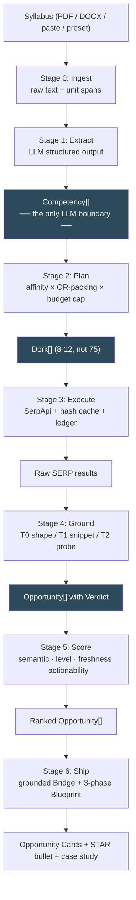

# S2S — Engineering Build Plan

**Companion to `IMPLEMENTATION_PLAN.md`.** That document is the *vision*: what S2S is, why it matters, and the full 55-feature ambition. This document is the *build*: the abstractions, file layout, algorithms, API contracts, credit math, phase order, and acceptance criteria needed to turn the vision into a working, demoable system.

Where the two disagree, this document is the one you code against. Every deviation from `IMPLEMENTATION_PLAN.md` is flagged inline with **[deviates]** and justified.

---

## Table of Contents

1. [Design thesis — the four ideas the build rests on](#1-design-thesis)
2. [Architecture at a glance](#2-architecture-at-a-glance)
3. [The three core abstractions](#3-the-three-core-abstractions)
4. [Target repository layout](#4-target-repository-layout)
5. [The pipeline, stage by stage](#5-the-pipeline-stage-by-stage)
6. [The Open-Mesh adapter registry](#6-the-open-mesh-adapter-registry)
7. [Credit economy — making 15 platforms cost 10 searches](#7-credit-economy)
8. [The Grounding Gate — "no dead links" made real](#8-the-grounding-gate)
9. [Scoring — the composite made computable](#9-scoring)
10. [The LLM layer](#10-the-llm-layer)
11. [UI specification](#11-ui-specification)
12. [Demo mode and fixtures](#12-demo-mode-and-fixtures)
13. [Differentiators beyond the 55](#13-differentiators-beyond-the-55)
14. [Build phases and acceptance criteria](#14-build-phases-and-acceptance-criteria)
15. [Feature coverage map (55 → phases)](#15-feature-coverage-map)
16. [Dependencies and environment](#16-dependencies-and-environment)
17. [Risk register](#17-risk-register)
18. [Open decisions](#18-open-decisions)

---

## 1. Design thesis

Four ideas carry the whole build. Everything in the rest of this document is an implementation of one of them.

### 1.1 The Competency is the only interface the LLM touches

The naive pipeline is `syllabus text → search keywords → results`. That fails across disciplines, because "search keywords" for a Finance unit and a Typography unit need completely different shapes, and the logic ends up duplicated per stream.

Instead, every syllabus — Arts, Commerce, Science, Engineering — is normalized into a list of **`Competency`** objects. The LLM's *only* job in the pipeline is `syllabus text → Competency[]`. Everything downstream (query building, scoring, filtering, ranking) is deterministic code operating on `Competency`.

This buys three things:
- **One codebase for all streams.** No per-discipline branches in the search engine.
- **Testability.** Fixtures at the `Competency` boundary mean the planner, scorer, and gate are unit-testable with zero API calls.
- **A no-LLM fallback.** If the Anthropic key is missing or rate-limited mid-demo, a heuristic extractor produces lower-quality `Competency[]` and the rest of the system runs unchanged.

### 1.2 Platforms are declarative data, not code

`IMPLEMENTATION_PLAN.md` promises "no platform limits." That is only real if adding a platform costs one dict entry, not a new Python module. So each platform is a **`PlatformAdapter`** — a declarative descriptor holding its domain, URL pattern, SerpApi engine, dork template, ecosystem badge, compensation type, trust tier, and liveness-check strategy.

Fifteen platforms = fifteen descriptors and one generic executor. That is what makes "Open-Mesh" an architecture rather than a slogan.

### 1.3 SerpApi credits are a budget to allocate, not a resource to consume

This is the single highest-leverage idea in the plan, and it is also the best story for a SerpApi hackathon: it demonstrates *sophisticated* API use rather than brute force.

Naive: 5 competencies × 15 platforms = **75 searches per student click**. On a 100-search free tier, two judges clicking twice ends the demo.

With the budget planner (§7): **8–12 searches** for the same coverage, via discipline-affinity platform selection + boolean OR-packing of competencies into single dorks. The UI shows the cost of every run (`this search cost 9 credits`), which doubles as a judge-facing talking point.

### 1.4 Honesty about liveness is a feature, not a caveat

Feature 50 claims "100% verifiable live URLs, no hallucinated links." Judges *will* click. Upwork and Catchafire gate their detail pages; Google's index of gig boards is routinely weeks stale. Pretending otherwise produces a demo that breaks on stage.

So S2S ships a **Grounding Gate** (§8): a free, three-tier liveness check that labels every card `Verified Live ✓`, `Unverified`, or `Archived — study reference`. Showing a verified-live badge with a timestamp is more impressive than silently showing a 404.

---

## 2. Architecture at a glance



**Single process, Streamlit only.** **[deviates]** The current `requirements.txt` pins `fastapi`, `uvicorn`, and `starlette`, none of which are imported. A two-tier split is unjustified for a hackathon. The `s2s/` package is kept import-clean (no Streamlit imports below `s2s/ui/`), so a FastAPI layer *can* be added later — but it is not built now.

**Two LLM touchpoints only:** Stage 1 (extraction) and Stage 6 (bridge + blueprint). Stages 2–5 are pure, deterministic, and unit-testable.

---

## 3. The three core abstractions

These go in `s2s/models.py`. Plain dataclasses — no ORM, no pydantic except where the Anthropic SDK needs it for structured output.

### 3.1 `Competency` — the normalized unit of "what you studied"

```python
from dataclasses import dataclass, field
from enum import Enum
from typing import Literal

class Discipline(str, Enum):
    COMMERCE_FINANCE = "commerce_finance"
    ARTS_HUMANITIES  = "arts_humanities"
    DESIGN_VISUAL    = "design_visual"
    CS_SOFTWARE      = "cs_software"
    DATA_QUANT       = "data_quant"
    LIFE_SCIENCES    = "life_sciences"
    LAW_POLICY       = "law_policy"
    MEDIA_COMM       = "media_comm"
    ENG_MECHANICAL   = "eng_mechanical"

Band = Literal["beginner", "intermediate", "advanced"]

@dataclass(frozen=True)
class Competency:
    canonical: str            # "13-week cash flow forecasting"
    aliases: list[str]        # ["cash flow projection", "liquidity forecast", "working capital model"]
    tools: list[str]          # ["Excel", "Google Sheets", "Python"]
    disciplines: list[Discipline]
    bloom: int                # 1 (Remember) .. 6 (Create)  → Feature 05
    band: Band                # derived from bloom + semester → Feature 06/20
    source_unit: str          # "Unit 3: Working Capital Management"
    source_span: str          # VERBATIM substring of the uploaded syllabus — Feature 22
    span_offset: int          # char offset into raw text, for highlighting
```

**`source_span` is load-bearing.** It must be a literal substring of the uploaded document. The bridge generator (§10.3) quotes it, and a post-validation step asserts `span in raw_text`. If the LLM paraphrases, the assertion fails and we fall back to a template bridge. This is what makes Features 22 and 29 one mechanism instead of two, and it is what prevents the most embarrassing possible failure: a confidently hallucinated claim about what is in the student's own syllabus.

**`aliases` is what makes the dork work.** Academic language ("Capital Asset Pricing Model") never appears in a gig listing. Market language ("cost of equity", "equity risk modeling") does. The LLM's real value-add is this translation.

### 3.2 `PlatformAdapter` — the declarative platform descriptor

```python
from dataclasses import dataclass
from typing import Callable, Literal

Engine      = Literal["google", "google_jobs", "google_scholar"]
Ecosystem   = Literal["ngo_impact", "freelance", "data_challenge", "hackathon", "open_source", "internship", "research"]
Comp        = Literal["paid", "stipend", "bounty", "volunteer", "prize", "credit_only"]
TrustTier   = Literal["A", "B", "C"]   # A = stable+indexed, B = gated/stale risk, C = high dead-link risk
LivenessChk = Literal["url_shape", "http_probe", "snippet_only"]

@dataclass(frozen=True)
class PlatformAdapter:
    key: str                      # "unv"
    label: str                    # "UN Online Volunteering"
    engine: Engine
    site: str | None              # "onlinevolunteering.org"  (None for non-google engines)
    url_pattern: str              # regex a valid detail URL must match  → Grounding Tier 0
    dork: str                     # template with {terms} and optional {negatives}
    ecosystem: Ecosystem
    compensation: Comp
    trust: TrustTier
    liveness: LivenessChk
    gate_markers: list[str]       # body/snippet strings meaning "dead": ["sign in to view", "has ended"]
    extra_params: dict            # engine-specific: {"chips": "date_posted:week"} etc.
```

Adding a 16th platform is one entry in `ADAPTERS`. That is the "No-Limit Principle" from `IMPLEMENTATION_PLAN.md` §1, implemented.

### 3.3 `Opportunity` — one live, scored, verified brief

```python
from datetime import datetime

@dataclass
class ScoreBreakdown:
    semantic: float        # 0..1
    level: float
    freshness: float
    actionability: float
    total: int             # 0..100, the weighted composite

    def explain(self) -> list[tuple[str, float, float]]:
        """[(term, raw_score, weighted_contribution)] — rendered in the UI."""

Verdict = Literal["live", "unverified", "archived"]

@dataclass
class Opportunity:
    title: str
    url: str
    snippet: str
    organization: str | None
    adapter_key: str
    posted_at: datetime | None
    verdict: Verdict
    verified_at: datetime | None
    matched_competency: Competency
    score: ScoreBreakdown
    est_hours: tuple[int, int] | None    # Feature 25: (4, 15) → "Weekend Sprint"
    bridge: str | None                   # Features 22 + 29, filled in Stage 6
    blueprint: "ShipBlueprint | None"    # Features 28/30/31
    star_bullet: str | None              # Feature 47
```

---

## 4. Target repository layout

```
serp hack/
├── app.py                          # Streamlit entry — routing + layout ONLY, no logic
├── s2s/
│   ├── __init__.py
│   ├── config.py                   # Settings dataclass (not module constants — see §4.1)
│   ├── models.py                   # §3: Competency, PlatformAdapter, Opportunity, ...
│   ├── pipeline.py                 # orchestrates Stages 0-6; the one public entrypoint
│   │
│   ├── ingest/
│   │   ├── loader.py               # PDF (pypdf) / DOCX (python-docx) / TXT / paste → raw text
│   │   └── structure.py            # regex unit/semester detection → curriculum tree
│   │
│   ├── extract/
│   │   ├── llm.py                  # Claude structured extraction  → Features 02, 03, 05
│   │   ├── heuristic.py            # no-LLM fallback (keyword + taxonomy lookup)
│   │   └── taxonomy.py             # discipline keywords, tool hints, Bloom verb map
│   │
│   ├── mesh/
│   │   ├── adapters.py             # the ADAPTERS registry       → Features 10-17
│   │   ├── affinity.py             # discipline × platform matrix → §7.2
│   │   ├── planner.py              # budget planner + OR-packing  → §7.3
│   │   ├── serpapi_client.py       # thin SerpApi wrapper (evolves src/serpapi_service.py)
│   │   ├── cache.py                # hash cache + demo replay     → Feature 14
│   │   └── ledger.py               # credit accounting            → §7.4
│   │
│   ├── ground/
│   │   ├── gate.py                 # T0/T1/T2 liveness            → Feature 50
│   │   └── dedupe.py               # URL canonicalization + title near-dup merge
│   │
│   ├── score/
│   │   ├── scorer.py               # the 4-term composite         → Feature 19
│   │   └── signals.py              # seniority, compensation, time-to-ship, scam filter
│   │                               #                              → Features 20, 23, 24, 25, 27
│   ├── ship/
│   │   ├── bridge.py               # grounded "Why You Can Do This" → Features 22, 29
│   │   ├── blueprint.py            # 3-phase playbook + toolkit     → Features 28, 30, 31
│   │   └── export.py               # STAR bullet, MD case study     → Features 47, 48
│   │
│   └── ui/
│       ├── sidebar.py              # key status, stream picker, budget meter
│       ├── cards.py                # opportunity card renderer
│       └── screens.py              # the 3 screens (§11)
│
├── fixtures/
│   ├── syllabi/                    # 4 preset syllabi             → Feature 04
│   │   ├── du_bcom_sem3.txt
│   │   ├── nid_bdes_sem1.txt
│   │   ├── vtu_cse_sem4.txt
│   │   └── du_sociology_sem2.txt
│   └── serpapi/                    # recorded responses for demo mode → §12
│
├── tests/
│   ├── test_planner.py             # budget math, OR-packing, affinity selection
│   ├── test_scorer.py              # each term independently + composite
│   ├── test_gate.py                # T0 regex per adapter, T1 marker detection
│   ├── test_adapters.py            # every adapter has valid regex + dork template
│   └── test_bridge_validation.py   # span-is-substring assertion
│
├── IMPLEMENTATION_PLAN.md          # the vision (unchanged)
├── BUILD_PLAN.md                   # this document
├── README.md                       # rewrite in Phase 5
├── requirements.txt                # REWRITE AS UTF-8 (§16)
├── .env.example
└── LICENSE                         # ADD — README badge currently links to a missing file
```

### 4.1 Why `config.py` must change

The current `src/config.py` reads env vars into module-level constants at import time:

```python
SERPAPI_API_KEY = os.getenv("SERPAPI_API_KEY", "")   # frozen at first import
```

Combined with Streamlit's rerun model, a key typed into the sidebar never reaches `SerpApiService`, and a `.env` created after launch is invisible until restart. Replace with a `Settings` dataclass built per-run:

```python
@dataclass
class Settings:
    serpapi_key: str
    anthropic_key: str | None
    demo_mode: bool
    credit_cap: int            # hard per-run ceiling
    cache_ttl_hours: int

    @classmethod
    def load(cls, override_serpapi: str | None = None) -> "Settings": ...
```

Also: `.env.example` advertises `ANTHROPIC_API_KEY` but `config.py` never reads it. Fixed here.

---

## 5. The pipeline, stage by stage

Each stage has a hard input/output contract. `s2s/pipeline.py` wires them; nothing else may call across stage boundaries.

### Stage 0 — Ingest

`bytes | str → RawSyllabus(text: str, tree: CurriculumNode, source: str)`

- PDF via `pypdf`, DOCX via `python-docx`, TXT/paste direct. Encoding detection via `charset-normalizer` (already a transitive dep). → **Feature 01**
- `structure.py` detects hierarchy with regexes over common Indian university syllabus formats: `Unit[\s\-–]*([IVX]+|\d+)`, `Module\s+\d+`, `Semester\s+([IVX]+|\d+)`, `Paper\s+[A-Z]{2,}\s*-?\s*\d+`. → **Feature 02**
- Character offsets preserved for every node, so `Competency.span_offset` can drive UI highlighting.
- Four presets ship as fixtures so the demo never depends on a file picker. → **Feature 04**

**Non-goal:** OCR. Scanned-image syllabi are out of scope; detect zero extractable text and say so clearly.

### Stage 1 — Extract

`RawSyllabus → Competency[]`

Primary path: one Claude call with structured output (§10.2). Fallback path: `heuristic.py` — tokenize unit titles, match against `taxonomy.py` keyword tables, emit lower-confidence competencies with `aliases` drawn from the taxonomy rather than generated.

**Cap at 6 competencies per run.** The planner's cost is linear in competency count; more than 6 produces diminishing coverage for linear credit spend. Pick the 6 with the highest Bloom level (practical > theoretical).

### Stage 2 — Plan

`Competency[] × Settings → Dork[]`

Pure function, zero I/O, fully unit-tested. See §7 for the algorithm. Output:

```python
@dataclass(frozen=True)
class Dork:
    adapter_key: str
    query: str                   # the fully-rendered search string
    covers: list[Competency]     # which competencies this one search answers
    engine: Engine
    params: dict                 # merged adapter.extra_params + freshness
    est_cost: int = 1            # SerpApi credits
```

### Stage 3 — Execute

`Dork[] → RawResult[]`

- Cache-first. Key = `sha256(engine + json.dumps(sorted_params_minus_api_key))`. Stored as `.cache/serpapi/<hash>.json` with a `fetched_at` stamp. → **Feature 14**
- Every call goes through `BudgetLedger.reserve()`. Over cap → the dork is skipped and *logged visibly* (never silently dropped).
- In demo mode the cache is read-only with infinite TTL: a cache miss returns empty rather than spending a credit. Guarantees zero spend on stage.
- `num=10` per search rather than issuing extra paginated searches — more results per credit.

### Stage 4 — Ground

`RawResult[] → Opportunity[]` (verdict assigned, duplicates merged)

See §8. Also handles canonicalization (strip UTM/tracking params, normalize trailing slashes, lowercase host) before dedupe, and merges near-duplicate titles via token-set ratio ≥ 0.9.

### Stage 5 — Score

`Opportunity[] × Competency[] → ranked Opportunity[]`

See §9. Also attaches the `signals.py` outputs: seniority band, compensation class, estimated time-to-ship, scam flag. → **Features 20, 23, 24, 25, 27**

### Stage 6 — Ship

`Opportunity → Opportunity` (with `bridge`, `blueprint`, `star_bullet` filled)

**Lazy, on-demand.** Generating a bridge + blueprint for every result wastes tokens on cards the student never opens. Generate when a card is expanded. The card list renders instantly from Stages 0–5; the expensive LLM call happens on click.

---

## 6. The Open-Mesh adapter registry

Seventeen adapters, graded by how reliably they actually return clickable live work. **This grading is the most important correction this plan makes to `IMPLEMENTATION_PLAN.md`**, which treats all platforms as equally viable.

### Tier A — build on these (stable URLs, well indexed, public detail pages)

| key | Platform | Engine | Dork template | Ecosystem | Comp |
|---|---|---|---|---|---|
| `unv` | UN Online Volunteering | google | `site:onlinevolunteering.org/en/opportunity ({terms})` | ngo_impact | volunteer |
| `kaggle` | Kaggle Competitions | google | `site:kaggle.com/competitions ({terms})` | data_challenge | prize |
| `unstop` | Unstop | google | `site:unstop.com (competitions OR hackathons OR case-competitions) ({terms})` | hackathon | prize |
| `devpost` | Devpost | google | `site:devpost.com ({terms}) hackathon` | hackathon | prize |
| `devfolio` | Devfolio | google | `site:devfolio.co/hackathons ({terms})` | hackathon | prize |
| `github` | GitHub good-first-issues | google | `site:github.com inurl:issues ("good first issue" OR "help wanted") ({terms})` | open_source | bounty |
| `drivendata` | DrivenData | google | `site:drivendata.org/competitions ({terms})` | data_challenge | prize |

### Tier B — include, but expect gating and label honestly

| key | Platform | Engine | Dork template | Ecosystem | Comp |
|---|---|---|---|---|---|
| `catchafire` | Catchafire | google | `site:catchafire.org ({terms})` | ngo_impact | volunteer |
| `taproot` | Taproot Plus | google | `site:taprootplus.org ({terms})` | ngo_impact | volunteer |
| `idealist` | Idealist | google | `site:idealist.org/en/volop ({terms})` | ngo_impact | volunteer |
| `volunteermatch` | VolunteerMatch | google | `site:volunteermatch.org ({terms})` | ngo_impact | volunteer |
| `zooniverse` | Zooniverse | google | `site:zooniverse.org/projects ({terms})` | research | volunteer |

### Tier C — high dead-link risk; off by default, opt-in toggle

| key | Platform | Engine | Dork template | Notes |
|---|---|---|---|---|
| `upwork` | Upwork | google | `site:upwork.com/freelance-jobs ({terms}) {negatives}` | login-gated detail pages; index routinely weeks stale |
| `freelancer` | Freelancer | google | `site:freelancer.com/projects ({terms}) {negatives}` | same class of problem |
| `contra` | Contra | google | `site:contra.com ({terms})` | thin index |

**[deviates]** `IMPLEMENTATION_PLAN.md` §4 puts Upwork front-and-centre in four of six stream blueprints. That is the plan's weakest load-bearing assumption. Upwork cards will frequently 404 or bounce to a login wall in front of judges, directly contradicting Feature 50. Keeping Tier C behind an opt-in toggle — labelled *"Commercial freelance (links may be gated)"* — preserves the pitch (students *do* want paid gigs) without betting the demo on it.

### Tier D — different SerpApi engine, not a `site:` dork

| key | Platform | Engine | Params | Ecosystem |
|---|---|---|---|---|
| `gjobs` | Google Jobs (India) | `google_jobs` | `location="India"`, `chips="date_posted:week"`, `q="{terms} intern"` | internship |
| `scholar` | Google Scholar | `google_scholar` | `q="{terms}"`, `as_ylo=2025` | research |

**These two are the "we know SerpApi deeply" exhibit.** A judge seeing `engine=google_jobs` with India-scoped `chips` freshness filters, alongside `engine=google_scholar` with a publication-year floor, alongside advanced boolean `site:` dorking, reads as genuine platform fluency rather than one endpoint called fifteen times. Build them in Phase 2 and make sure they appear in the demo.

### 6.1 On freshness: `tbs=qdr:w` does not do what Feature 18 claims

**[deviates]** Feature 18 promises freshness enforcement via `tbs=qdr:w`. That parameter filters on *Google's index date*, which for gig and competition boards is frequently months off the actual posting date. Applying it aggressively silently discards live listings.

Correct approach, split in two:
- **Where the engine has a real posting-date filter, use it.** `google_jobs` supports `chips=date_posted:today|3days|week|month` — that one is trustworthy, and it is the only place we rely on a provider-side freshness filter.
- **Everywhere else, derive freshness from the result itself** — snippet date strings, `rich_snippet` fields, deadline text — and feed it to `S_freshness` with an explicit *unknown-date penalty* rather than pretending we know. Use `tbs=qdr:m` (month, generous) only as a soft recall bias, never as a hard gate.

---

## 7. Credit economy

### 7.1 The problem, quantified

| Approach | Searches per student click |
|---|---|
| Naive (every competency × every platform) | 6 × 17 = **102** |
| Platform-affinity selection only | 6 × 5 = **30** |
| Affinity + OR-packing (**this plan**) | 2 × 5 = **10** |

On a 100-search monthly free tier, the naive approach allows *one* run per month. This plan allows ten, with caching making repeat demos free.

### 7.2 The affinity matrix

`affinity.py` holds a static `dict[(Discipline, adapter_key), float]` in `0.0 .. 1.0`. Expected-yield prior: how likely is this platform to hold live work for this discipline?

| | unv | kaggle | unstop | github | catchafire | gjobs | devpost | scholar |
|---|---|---|---|---|---|---|---|---|
| commerce_finance | 0.7 | 0.3 | **0.9** | 0.0 | **0.9** | 0.7 | 0.2 | 0.3 |
| arts_humanities | **0.9** | 0.0 | 0.5 | 0.0 | **0.8** | 0.4 | 0.1 | 0.6 |
| design_visual | 0.6 | 0.0 | 0.6 | 0.1 | **0.9** | 0.6 | 0.3 | 0.1 |
| cs_software | 0.3 | 0.7 | **0.8** | **0.9** | 0.2 | **0.8** | **0.9** | 0.4 |
| data_quant | 0.5 | **0.9** | 0.7 | 0.5 | 0.4 | 0.7 | 0.6 | 0.6 |
| life_sciences | 0.4 | **0.8** | 0.4 | 0.2 | 0.3 | 0.5 | 0.3 | **0.8** |
| law_policy | **0.9** | 0.0 | 0.6 | 0.0 | **0.8** | 0.5 | 0.1 | 0.7 |

Zeroes matter as much as the highs: a Design student should never burn a credit on Kaggle, and a Sociology student should never burn one on GitHub. That alone cuts the search count by more than half.

### 7.3 The planner algorithm

```python
def plan(competencies: list[Competency], settings: Settings) -> list[Dork]:
    # 1. Which platforms are worth it for this student?
    scores = {a.key: max(AFFINITY.get((d, a.key), 0.0)
                         for c in competencies for d in c.disciplines)
              for a in ADAPTERS}
    chosen = [k for k, s in sorted(scores.items(), key=lambda kv: -kv[1])
              if s >= AFFINITY_FLOOR][:settings.max_platforms]        # default 5

    # 2. Pack competencies into OR-groups. This is where the savings come from.
    #    ("cash flow" OR "liquidity analysis" OR "working capital")
    #    — one search answers three competencies.
    groups = pack(competencies, per_group=settings.terms_per_dork)     # default 3

    # 3. Render one dork per (platform, group), respecting the hard cap.
    dorks, ledger = [], BudgetLedger(cap=settings.credit_cap)         # default 12
    for key in chosen:
        for group in groups:
            d = render(ADAPTERS[key], group)
            if not ledger.can_afford(d.est_cost):
                log.warning("budget cap reached — skipped %s / %s", key, group)
                return dorks                                           # visible, never silent
            ledger.reserve(d.est_cost); dorks.append(d)
    return dorks
```

**`pack()` is the core trick.** Each `Competency` contributes its 2–3 strongest alias phrases to an OR-group:

```
site:catchafire.org ("cash flow forecast" OR "working capital" OR "financial model"
                     OR "budget projection" OR "liquidity analysis")
```

One credit, five market phrasings, three syllabus units covered. Google's boolean `OR` within a `site:` scope handles this well, and relevance is recovered downstream: Stage 5 scores each result against each individual competency, so OR-packing costs nothing in match precision — only in per-result recall depth, which `num=10` offsets.

**Guard:** cap OR-groups at ~6 quoted phrases. Beyond that Google's relevance degrades and results drift off-topic. `terms_per_dork=3` with 2 aliases each lands at 6.

### 7.4 The ledger

```python
@dataclass
class BudgetLedger:
    cap: int
    spent: int = 0
    entries: list[LedgerEntry] = field(default_factory=list)
    # LedgerEntry: (adapter_key, query, cost, cache_hit: bool, timestamp)

    def can_afford(self, cost: int) -> bool: return self.spent + cost <= self.cap
    def reserve(self, cost: int) -> None: ...
    def summary(self) -> str:   # "9 live searches · 4 cache hits · 3 credits remaining"
```

Rendered in the sidebar on every run. This is both an engineering safeguard and the credit-efficiency demo.

---

## 8. The Grounding Gate

Three tiers, cheapest first. Tiers 0 and 1 cost nothing. Tier 2 costs a plain HTTP request — **not** a SerpApi credit.

### Tier 0 — URL shape (free, instant)

Regex the result URL against `adapter.url_pattern`. A `site:upwork.com/freelance-jobs` dork regularly returns `upwork.com/`, `upwork.com/hire/`, category landing pages, and blog posts. None are opportunities. This single filter removes most junk before anything else runs.

```python
ADAPTERS["unv"].url_pattern = r"^https?://(www\.)?onlinevolunteering\.org/en/opportunity/[\w\-]+"
ADAPTERS["kaggle"].url_pattern = r"^https?://(www\.)?kaggle\.com/competitions/[\w\-]+/?$"
```

### Tier 1 — snippet signals (free)

- Parse any date from the snippet / `rich_snippet` / `date` field → populates `posted_at`.
- Scan for `adapter.gate_markers`: `"this competition has ended"`, `"applications are closed"`, `"sign in to view"`, `"no longer accepting"`. A hit → `verdict = "archived"`.

### Tier 2 — HTTP probe (free, ~200ms, concurrent)

Only for `liveness == "http_probe"` adapters, only for the top-N scored results (default 12), run concurrently with a 3s timeout:

```python
def probe(url: str, adapter: PlatformAdapter) -> Verdict:
    r = requests.get(url, timeout=3, allow_redirects=True,
                     headers={"User-Agent": UA})
    if r.status_code != 200:                                   return "archived"
    if not re.match(adapter.url_pattern, r.url):               return "archived"   # bounced to /login or /404
    if any(m in r.text[:60_000].lower() for m in adapter.gate_markers): return "archived"
    return "live"
```

Checking `r.url` after redirects is what catches the Upwork/Catchafire login-wall case: status 200, but the final URL is a sign-in page.

### Verdict handling in the UI

| Verdict | UI treatment |
|---|---|
| `live` | `✓ Verified Live` badge + `checked 2m ago`. Default section. |
| `unverified` | `○ Unverified` — probe timed out or adapter is `snippet_only`. Shown, honestly labelled. |
| `archived` | Moved to a collapsed **"Archived — useful as study references"** section. Never shown as live work. |

**[deviates]** This replaces Feature 50's absolute claim ("100% of cards contain verifiable live URLs") with something true and demonstrable: every card carries a *verified verdict*. Stronger on stage, because it survives being clicked.

---

## 9. Scoring

`IMPLEMENTATION_PLAN.md` §6.1 gives the formula but not one computable term. Here is each, concretely.

```python
WEIGHTS = {"semantic": 0.45, "level": 0.25, "freshness": 0.15, "actionability": 0.15}
```

### 9.1 `S_semantic` (0.45) — hybrid lexical, embedding-optional

```python
def semantic(c: Competency, o: RawResult) -> float:
    title, body = o.title.lower(), o.snippet.lower()
    score = 0.0
    for phrase in [c.canonical, *c.aliases]:
        p = phrase.lower()
        if p in title: score += 1.0          # title match is the strongest signal
        elif p in body: score += 0.5
        else:
            toks = set(p.split())            # partial credit for token overlap
            if toks and len(toks & set(body.split())) / len(toks) >= 0.6:
                score += 0.25
    for tool in c.tools:
        if tool.lower() in body: score += 0.3
    return min(1.0, score / SEMANTIC_TARGET)  # SEMANTIC_TARGET = 2.5
```

**Deliberately no mandatory embedding API.** An embedding dependency is a second external service that can fail mid-demo. If an Anthropic key is present, Phase 4 may blend in a semantic similarity score at weight 0.4 of this term — but the lexical path alone must produce a working demo. Robustness beats elegance here.

### 9.2 `S_level` (0.25)

```python
BAND_ORD = {"beginner": 0, "intermediate": 1, "advanced": 2}

def level(c: Competency, o: RawResult) -> float:
    task = infer_band(o)                     # from signals.py keyword scan
    return 1.0 - abs(BAND_ORD[c.band] - BAND_ORD[task]) / 2.0
```

`infer_band()` in `signals.py`: `advanced` on `senior|lead|principal|architect|PhD|5\+ years|expert`; `beginner` on `good first issue|intern|beginner|entry.level|no experience|first.time`; else `intermediate`. → **Features 20, 23**

### 9.3 `S_freshness` (0.15)

```python
UNKNOWN_DATE_PENALTY = 0.35   # explicit, not a silent zero
TAU_DAYS = 21.0

def freshness(o: RawResult) -> float:
    if o.posted_at is None: return UNKNOWN_DATE_PENALTY
    age = (now() - o.posted_at).days
    return math.exp(-max(age, 0) / TAU_DAYS)
```

The explicit unknown-date penalty matters: most `site:` dork results carry no parseable date. Scoring them 0 would push every NGO brief below every hackathon, which is wrong. Scoring them 1.0 would be dishonest. 0.35 says "we don't know, treat with mild suspicion."

### 9.4 `S_actionability` (0.15)

```python
TRUST = {"A": 1.0, "B": 0.7, "C": 0.4}
VERDICT = {"live": 1.0, "unverified": 0.5, "archived": 0.0}
DELIVERABLE_NOUNS = {"report", "model", "design", "dashboard", "analysis", "logo",
                     "survey", "policy brief", "dataset", "prototype", "audit",
                     "template", "guidelines", "script", "plan", "deck"}

def actionability(o: Opportunity, a: PlatformAdapter) -> float:
    clarity = 1.0 if any(n in o.snippet.lower() for n in DELIVERABLE_NOUNS) else 0.4
    return 0.5 * VERDICT[o.verdict] + 0.3 * TRUST[a.trust] + 0.2 * clarity
```

This is where the Grounding Gate feeds back into ranking: an archived card scores 0 on half this term and sinks automatically.

### 9.5 Transparency is the differentiator

`ScoreBreakdown.explain()` is rendered in every expanded card:

```
Match 87%
  Semantic alignment    0.92  →  41.4
  Semester/level fit    0.85  →  21.3
  Freshness             0.71  →  10.7
  Actionability         0.90  →  13.5
```

Every competitor shows an opaque "AI match: 87%". Showing the arithmetic is more credible, is trivially cheap, and directly demonstrates that Feature 19 is a real weighted metric rather than a number from a language model.

---

## 10. The LLM layer

### 10.1 Model and SDK

**`claude-opus-5` via the official `anthropic` Python SDK.** $5/M input, $25/M output, 1M context, 128K max output.

Facts that shape the code (verified against current API docs, not recalled):

- **No `temperature` / `top_p` / `top_k`.** Sending any of them returns a 400 on this model. Steer with prompting.
- **Thinking is on by default.** Omitting `thinking` runs adaptive thinking; `max_tokens` caps thinking *plus* response text together, so size it with headroom.
- Control depth via `output_config={"effort": ...}`. Use `"low"` for extraction (a mechanical mapping task) and `"medium"` for bridge/blueprint generation (requires judgement).
- **Prompt-cache minimum is 512 tokens** on this model — easily cleared by a syllabus.
- `pip install anthropic`. Credentials resolve from `ANTHROPIC_API_KEY`, so construct the client with no arguments.

### 10.2 Extraction via structured output (Stage 1)

Use `client.messages.parse()` with a Pydantic schema — validation happens at the SDK layer, so no JSON parsing or repair logic is needed.

```python
from pydantic import BaseModel
import anthropic

class ExtractedCompetency(BaseModel):
    canonical: str
    aliases: list[str]
    tools: list[str]
    disciplines: list[str]
    bloom: int
    source_unit: str
    source_span: str      # MUST be verbatim from the syllabus

class Extraction(BaseModel):
    competencies: list[ExtractedCompetency]

client = anthropic.Anthropic()

resp = client.messages.parse(
    model="claude-opus-5",
    max_tokens=8000,
    output_config={"effort": "low"},
    system=[{
        "type": "text",
        "text": EXTRACTION_SYSTEM_PROMPT + TAXONOMY_REFERENCE,
        "cache_control": {"type": "ephemeral"},        # stable prefix → cached across runs
    }],
    messages=[{"role": "user", "content": syllabus_text}],
    output_format=Extraction,
)
competencies = resp.parsed_output.competencies
```

**Post-validation is mandatory.** For each returned competency, assert `source_span in raw_text` (after whitespace normalization). Drop any that fail and log it. This is the guardrail that stops a hallucinated syllabus quotation from reaching a student.

### 10.3 Grounded bridge generation (Stage 6)

The prompt is given exactly two inputs — the verbatim syllabus span and the live SerpApi snippet — and instructed to ground every claim in one of them.

```python
BRIDGE_SYSTEM = """You explain to a student why their coursework already qualifies them
for a specific live project.

You will receive exactly two pieces of evidence:
  <syllabus_unit>  — verbatim text from the student's own syllabus
  <live_brief>     — the title and snippet of a real, currently-open project

Rules:
- Quote the syllabus unit verbatim at least once. Do not paraphrase it as if quoting.
- Reference only what the live brief actually says. Never invent a requirement,
  a deliverable, a deadline, or an organization name that is not in the brief.
- Name the specific technique, formula, or method from the unit that applies.
- 3-4 sentences. Second person. Concrete and encouraging, not inspirational filler.
- If the unit genuinely does not prepare the student for this brief, say so plainly."""
```

Caching layout matters here, because this call runs once per card the student opens:

```python
system=[
    {"type": "text", "text": BRIDGE_SYSTEM},
    {"type": "text", "text": f"<syllabus>{raw_text}</syllabus>",
     "cache_control": {"type": "ephemeral"}},        # ← breakpoint AFTER the syllabus
]
messages=[{"role": "user", "content": render_brief(opportunity)}]   # only this varies
```

The syllabus sits in the cached prefix; only the brief varies per call. Cache reads cost ~0.1× input, so expanding ten cards costs roughly one full syllabus read instead of ten.

Then validate: if the generated bridge does not contain a ≥40-character literal substring of `competency.source_span`, discard it and emit the template bridge instead.

### 10.4 Cost per run

| Call | Tokens | Cost |
|---|---|---|
| Extraction (1×) | ~5k in / 2k out | $0.075 |
| Cache write (1×) | ~4.5k @ 1.25× | $0.028 |
| Bridge + blueprint (10×) | 4.5k cache-read + 0.5k fresh in + 0.8k out each | $0.248 |
| **Total per full syllabus run** | | **≈ $0.35** |

Negligible for a hackathon. Measure real numbers with `client.messages.count_tokens()` before trusting this estimate, and verify caching is working by asserting `resp.usage.cache_read_input_tokens > 0` on the second bridge call — if it is zero, something in the prefix is varying.

### 10.5 The no-LLM path is not optional

`extract/heuristic.py` and a template bridge must both work with `ANTHROPIC_API_KEY` unset. Hackathon wifi fails; API keys hit rate limits at exactly the wrong moment. A demo that hard-depends on two external APIs has two single points of failure. The sidebar shows which mode is active.

---

## 11. UI specification

Three screens, Streamlit, no custom JS.

### Screen 1 — Ingest

- Stream selector (9 disciplines) + semester picker (1–8) → calibrates `Competency.band`. → **Feature 06**
- Four one-click presets, prominent. **The demo always uses a preset** — never a live file upload on stage.
- File uploader (PDF/DOCX/TXT) + paste textarea as the real-world path.
- Submit → progress indicator that names each stage as it runs ("Extracting competencies… Planning 10 searches across 5 platforms… Verifying links…"). The staged progress *is* the explanation of the architecture; judges learn the pipeline by watching it run.

### Screen 2 — Results

- **Left rail:** the parsed curriculum tree, with matched units highlighted. → **Feature 22**
- **Main:** ranked opportunity cards. Each collapsed card shows title, organization, ecosystem badge, compensation chip, match %, verdict badge, time-to-ship chip.
- **Expanded card** adds: full snippet, score breakdown table (§9.5), the grounded bridge, the 3-phase blueprint, free-toolkit list, STAR bullet, and a direct `Apply →` link.
- **Filters:** ecosystem, compensation type, difficulty band, verdict, time-to-ship. → **Feature 21**
- **Sidebar:** key status, LLM mode (Claude / heuristic), demo-vs-live indicator, and the budget meter (`9 searches · 4 cache hits · 3 credits left`).
- **Collapsed bottom section:** archived results, honestly framed as study references.

### Screen 3 — Ship

- Markdown case-study export. → **Feature 48**
- STAR bullet, copyable. → **Feature 47**
- Milestone checkboxes persisted in `st.session_state`. → **Feature 36**
- Self-contained HTML proof-of-work card download. → **Feature 51**

**Keep the existing "Multi-Engine Explorer" tab** from `app.py` as a developer/debug tab. It is genuinely useful for probing new adapters, and it shows off SerpApi's engine breadth. Move it behind a "Dev" expander.

---

## 12. Demo mode and fixtures

**This is the highest value-per-line-of-code item in the entire plan.**

- A `--demo` flag / sidebar toggle puts the cache in read-only, infinite-TTL mode. Zero SerpApi credits, zero network dependency for search.
- `fixtures/serpapi/` holds recorded real responses for all four preset syllabi × five platforms, captured during development with a `scripts/record_fixtures.py` helper.
- The UI always shows which mode is active: `● LIVE (12 credits)` or `◉ DEMO (cached responses)`. **Never silently fake live data** — that is the line between a reliable demo and a dishonest one, and judges reward being told the difference.
- Bridges and blueprints for preset syllabi are pre-generated into fixtures too, so the demo survives an Anthropic outage as well.

Record fixtures in Phase 1, the moment the first two adapters work. Everything after that is developed against fixtures, which makes the whole build cheap in credits.

---

## 13. Differentiators beyond the 55

Four additions, in priority order. All are cheap because they reuse data the pipeline already produces. Marked clearly so they do not displace the spine.

### 13.1 Syllabus Gap Report ⭐ *strongest judge moment, build it*

After matching, invert the question: **which syllabus units returned zero live opportunities across every platform?**

> *Unit 5 — "Punch Card Data Processing and Batch Job Control" matched **0** live projects across 17 platforms. The closest live demand is for pipeline orchestration (Airflow, dbt) — 34 open briefs this week.*

This is computed entirely from data already in hand (competencies with no scored results above threshold) plus one extra SerpApi call for the modern-equivalent lookup. It converts S2S from "a job matcher" into "evidence that your curriculum has drifted from the market" — a far more shareable, more emotionally resonant claim, and one no competitor will have. Phase 4.

### 13.2 Interdisciplinary Bridge

Combine competencies from two different subjects into one OR-group and surface tasks neither subject alone would find — Statistics + Sociology → a UN survey-analysis assignment. This is `Feature 08` taken seriously, and it is almost free: it is just a different `pack()` strategy. It demonstrates that the `Competency` abstraction (§1.1) actually buys something. Phase 4.

### 13.3 Cohort Mode

One syllabus, N students → distribute non-overlapping opportunities so an entire class ships different work. Greedy assignment over the already-ranked list; no new API calls. Makes the institutional pitch (`Feature 55`) concrete in a single screen. Phase 4, time permitting.

### 13.4 Credit-efficiency panel

A dev-tab panel showing naive cost vs. planned cost for the current run (`102 searches → 10 searches, 90% reduction`). Pure instrumentation over the ledger. For a SerpApi hackathon specifically, this is a strong signal — and it costs about twenty lines. Phase 2.

---

## 14. Build phases and acceptance criteria

### Phase 0 — Unblock (≈45 min)

Nothing works until these are done.

1. Rewrite `requirements.txt` as **UTF-8** (currently UTF-16LE with a BOM; `pip install -r` fails on line 1).
2. Resolve the SDK conflict: keep `google-search-results`, drop `serpapi==1.1.2`. Both install into the `serpapi` namespace, and `from serpapi import GoogleSearch` only exists in the former — today, whichever pip resolves last silently decides whether the app runs.
3. Drop unused `fastapi` / `uvicorn` / `starlette` pins.
4. `python3.12 -m venv .venv` (system Python is 3.14.4; several pins lack wheels for it).
5. `cp .env.example .env`, add keys. Add `ANTHROPIC_API_KEY` to `config.py`, which currently ignores it.
6. Add the missing `LICENSE` file (README badge links to it).

**Acceptance:** `pip install -r requirements.txt` succeeds in a clean venv; `python test_serpapi.py` reports a live connection; `streamlit run app.py` loads.

### Phase 1 — The thin vertical slice (the spine)

Build one complete path from syllabus to scored card. Breadth comes later.

- `models.py`, `config.py` (Settings), `pipeline.py`
- `ingest/` complete (all four formats + 4 presets)
- `extract/llm.py` + `extract/heuristic.py` + `taxonomy.py`
- `mesh/`: **two adapters only** — `unv` and `kaggle` (both Tier A, both reliably indexed)
- `mesh/serpapi_client.py` + `cache.py` + `ledger.py`
- `ground/gate.py` Tiers 0 and 1
- `score/scorer.py` complete, all four terms
- `ui/`: Screens 1 and 2, cards without bridge/blueprint
- **Record fixtures.** Everything after this point develops offline.
- `tests/test_scorer.py`, `tests/test_adapters.py`

**Acceptance:** Upload the DU B.Com preset → see ≥5 scored, Tier-0-validated, clickable UN Volunteering / Kaggle opportunities with visible score breakdowns, for ≤4 SerpApi credits. Second identical run costs 0 credits (cache hit).

### Phase 2 — Open-Mesh breadth + the credit story

- All 17 adapters registered, including `google_jobs` and `google_scholar` (§6 Tier D)
- `affinity.py` matrix complete for all 9 disciplines
- `planner.py` with OR-packing and the hard budget cap
- `ground/gate.py` Tier 2 (concurrent HTTP probes) + `dedupe.py`
- `score/signals.py` (seniority, compensation, time-to-ship, scam filter)
- Tier C opt-in toggle
- Credit-efficiency panel (§13.4)
- `tests/test_planner.py`, `tests/test_gate.py`

**Acceptance:** All four preset syllabi return ≥8 opportunities spanning ≥4 distinct ecosystems, for ≤12 credits each. Every card carries a verdict badge. The ledger proves the naive-vs-planned saving. Zero cards shown as live that 404 on click.

### Phase 3 — Bridge, Blueprint, Proof-of-Work

- `ship/bridge.py` with the substring-validation guard and template fallback
- `ship/blueprint.py` — 3-phase playbook + free-toolkit recommender
- `ship/export.py` — STAR bullet + Markdown case study
- Screen 3
- `tests/test_bridge_validation.py`
- Pre-generate bridges for all preset syllabi into fixtures

**Acceptance:** Expanding any card yields a bridge that quotes the student's actual syllabus verbatim (assertion-verified), a 3-phase plan, and a copyable STAR bullet. Works with `ANTHROPIC_API_KEY` unset (template path).

### Phase 4 — Differentiators

- Syllabus Gap Report (§13.1) — **build this one first**
- Interdisciplinary Bridge (§13.2)
- Cohort Mode (§13.3), time permitting
- Optional embedding blend in `S_semantic`

**Acceptance:** Gap Report names ≥1 genuinely dead syllabus unit per preset with a live modern-equivalent comparison.

### Phase 5 — Demo hardening

- Full demo-mode fixture coverage for all four streams
- **Link audit:** click every link in every preset's results, in an incognito window. Any dead link shown as live is a release blocker.
- End-to-end run across all four streams, timed
- README rewrite — architecture, the credit-efficiency story, honest platform tiering
- Rehearse the demo script below to a stopwatch

**Acceptance:** Four streams, zero crashes, zero dead live-links, under 90 seconds per stream, running entirely from fixtures with no network.

### 14.1 The demo script (write this before Phase 5, not after)

1. *"A third-semester B.Com student in Mumbai. This is her actual syllabus."* → preset, one click.
2. *"Unit 3 is Working Capital Management. She can recite the Cash Conversion Cycle formula. She has never seen a real balance sheet."*
3. Run. **Narrate the staged progress bar** — extraction, planning, grounding. The pipeline explains itself.
4. *"Ten searches across five platforms. Not seventy-five — we allocate credits by discipline affinity and pack competencies into boolean groups."* → budget meter.
5. Expand the top card. **Click the link live, in front of them.** It opens. `✓ Verified Live`.
6. Read the bridge aloud — *"In Unit 3 you derived the cash conversion cycle…"* — and point at the highlighted unit in the left rail. The quote is verbatim from her own syllabus.
7. Switch to the NID Design preset. **Same engine, zero code changes, completely different ecosystem.** This is the all-streams claim, demonstrated rather than asserted.
8. Gap Report: *"And Unit 5 of her syllabus matched nothing, anywhere. Here is what the market wants instead."*

---

## 15. Feature coverage map

55 features from `IMPLEMENTATION_PLAN.md` §5, assigned honestly. **26 of the 55 are marked P0 in the vision document; a hackathon demo cannot ship 26 features well.** This map picks the 14 that carry the pitch.

| Phase | Features | Count |
|---|---|---|
| **1 — Spine** | 01, 02, 03, 04, 12, 13, 14, 19, 20, 21, 22, 49, 50 (partial), 06 | **14** |
| **2 — Breadth** | 09, 10, 11, 15, 16, 17, 18 (reframed, §6.1), 23, 24, 25, 27, 50 (complete) | 12 |
| **3 — Ship** | 05, 28, 29, 30, 31, 34, 35, 47, 48 | 9 |
| **4 — Depth** | 08, 26, 32, 33, 36, 38, 39, 40, 41, 51 | 10 |
| **Deferred** | 07, 37, 42, 43, 44, 45, 46, 52, 53, 54, 55 | 11 |

**Why the deferrals** (stated plainly rather than quietly dropped):

- **38–46 (stream specialization engines)** are *mostly already delivered* by the `Competency` + affinity architecture. Features 38, 39, 40, 41 fall out of the adapter registry for free, which is the payoff of §1.1. Features 42–46 are additional affinity-matrix rows, not new code — a ten-minute change each when needed.
- **07 (lab appendix harvester), 37 (mock client Q&A), 45/46 (media, mechanical)** — real features, no demo leverage.
- **52 (LinkedIn post drafter), 53 (faculty credit packet)** — pure LLM text generation on data already in hand. Fast to add post-hackathon; adds nothing to the live demo.
- **54 (WhatsApp/Telegram bot)** — requires a messaging integration, hosting, and a scheduler. P3 in the vision document, and correctly so.
- **55 (dean analytics)** — needs multi-user persistence. Cohort Mode (§13.3) is the single-screen version of this pitch.

---

## 16. Dependencies and environment

### 16.1 `requirements.txt` — rewrite as UTF-8

Direct dependencies only. Transitive deps (pandas, numpy, altair, pyarrow, requests, jinja2, …) resolve automatically; pinning 50 transitive packages is what produced the current brittle, PowerShell-mangled file.

```
# --- core ---
streamlit>=1.40
python-dotenv>=1.0

# --- SerpApi (provides `from serpapi import GoogleSearch`) ---
# Do NOT also install the `serpapi` package — same namespace, conflicting API.
google-search-results>=2.4.2

# --- LLM ---
anthropic>=0.69

# --- document ingestion ---
pypdf>=5.0
python-docx>=1.1

# --- liveness probe ---
requests>=2.32

# --- dev ---
pytest>=8.0
```

Regenerate pins later with `python -m pip freeze > requirements.txt` from an activated venv — and on Windows, `pip freeze | Out-File -Encoding utf8 requirements.txt`, which is the specific step that produced the current UTF-16 file.

### 16.2 Environment

```
SERPAPI_API_KEY=...        # required
ANTHROPIC_API_KEY=...      # optional — heuristic fallback if absent
S2S_DEMO_MODE=false        # true → read-only cache, zero credits
S2S_CREDIT_CAP=12          # hard per-run SerpApi ceiling
S2S_MAX_PLATFORMS=5
S2S_TERMS_PER_DORK=3
S2S_CACHE_TTL_HOURS=72
```

Python **3.12** in a venv. (System Python is 3.14.4; several pinned wheels may not exist for it yet.)

---

## 17. Risk register

| # | Risk | Likelihood | Impact | Mitigation |
|---|---|---|---|---|
| 1 | SerpApi credits exhausted before/during demo | **High** | **Fatal** | Budget cap + ledger (§7.4); demo mode with fixtures (§12); develop against fixtures from Phase 1 onward |
| 2 | Judge clicks a dead link | **High** | **Severe** | Grounding Gate (§8); Tier C off by default; Phase 5 link audit is a release blocker |
| 3 | Hackathon wifi fails | Medium | Fatal | Demo mode requires no network at all — fixtures cover search *and* LLM output |
| 4 | LLM hallucinates the student's syllabus content | Medium | **Severe** (destroys credibility) | `source_span` substring assertion in both Stage 1 and Stage 6; template fallback (§10.2–10.3) |
| 5 | Scope creep toward 55 features | **High** | Severe | §15 coverage map is the contract; spine first, Phase 4 only once Phases 1–3 are green |
| 6 | Dorks return landing pages, not opportunities | High | Moderate | Grounding Tier 0 regex per adapter (§8) — cheapest, highest-yield filter in the system |
| 7 | OR-packing degrades relevance | Medium | Moderate | Cap at 6 quoted phrases; per-competency scoring downstream recovers precision; A/B packed vs unpacked in Phase 2 |
| 8 | Anthropic key missing or rate-limited | Medium | Moderate | Heuristic extractor + template bridge are first-class paths, not stubs (§10.5) |
| 9 | Preset syllabi are not representative | Low | Moderate | Source all four from real published university syllabi; cite the source in each fixture |
| 10 | Two people editing the same module | Medium | Low | Stage boundaries are the work boundaries — ingest/extract, mesh/ground, score/ship split cleanly |

---

## 18. Open decisions

These need your input. Each has a working default so the build is not blocked.

| # | Decision | Assumed default | Why it matters |
|---|---|---|---|
| 1 | **Actual SerpApi quota** — free 100/month, or a hackathon-issued key with more? | 100/month, cap 12/run | Directly sets `S2S_CREDIT_CAP` and how aggressively we can develop against live search |
| 2 | **Anthropic key available?** | Assume yes; heuristic fallback built regardless | Determines whether extraction quality is a demo strength or a known weakness |
| 3 | **Which 4 streams to demo?** | Commerce (DU B.Com), Design (NID B.Des), CS (VTU B.Tech), Social Sciences (DU Sociology) | These four maximize *visible* ecosystem diversity — NGO, freelance, open-source, UN |
| 4 | **Team size / split** | Solo | Changes phase sequencing; with 2+, mesh/ground and score/ship parallelize cleanly after Phase 1 |
| 5 | **Submission deadline** | Unknown | Determines whether Phase 4 happens at all. Phases 0–3 + 5 are the minimum viable submission |
| 6 | **Is a hosted deployment required, or is a local/recorded demo acceptable?** | Local | Streamlit Community Cloud adds a deploy step and a secrets-management step |

---

## Appendix A — Deviations from `IMPLEMENTATION_PLAN.md`, collected

| § | Deviation | Reason |
|---|---|---|
| 2 | Drop FastAPI/uvicorn; Streamlit single-process | Pinned but unimported; a two-tier split is unjustified at this scope |
| 6 | Platforms graded into Tiers A–D rather than treated as equally viable | Upwork and Catchafire gate detail pages; honest grading protects the demo |
| 6 | Upwork/Freelancer/Contra moved behind an opt-in toggle | They are the primary dead-link risk, and Feature 50 claims no dead links |
| 6.1 | Feature 18 reframed: `tbs=qdr:w` is not a reliable freshness gate | It filters on Google's index date, not the posting date |
| 7 | Added the budget planner + OR-packing (not in the original plan) | 102 searches per click is not viable on any realistic quota |
| 8 | Added the Grounding Gate; Feature 50 restated as "verified verdict" not "100% live" | The absolute claim cannot be honoured against gated platforms |
| 9 | Embedding similarity is optional, not required, in `S_semantic` | A second mandatory external API is a second demo failure mode |
| 10 | `source_span` substring validation added as a hard guard | Prevents hallucinated claims about the student's own syllabus |
| 12 | Demo mode with recorded fixtures added | Highest-value reliability feature in the plan; near-zero cost |
| 13 | Four features added beyond the 55 | Gap Report in particular is the strongest differentiator available |
| 15 | 26 "P0" features reduced to a 14-feature demo spine | 26 features cannot be shipped well in a hackathon |
