# 🎓 S2S (Syllabus-to-Ship): Master Implementation Plan & Feature Blueprint
### An Open-Mesh Platform Engine Connecting Academic Curricula to Real-World Work

---

## 📑 Table of Contents
1. [Core Mission & The Open-Mesh Philosophy](#1-core-mission--the-open-mesh-philosophy)
2. [The Open-Mesh Platform Ecosystem (No Platform Limits)](#2-the-open-mesh-platform-ecosystem)
3. [End-to-End System Mechanics & Architecture](#3-end-to-end-system-mechanics--architecture)
4. [Multi-Disciplinary Stream Blueprints](#4-multi-disciplinary-stream-blueprints)
5. [Master 55-Feature Catalog (Ranked P0 to P3)](#5-master-55-feature-catalog)
6. [Scoring, Relevance & "The Pedagogical Bridge"](#6-scoring-relevance--the-pedagogical-bridge)
7. [System Execution Phases & Delivery Roadmap](#7-system-execution-phases--delivery-roadmap)

---

## 1. Core Mission & The Open-Mesh Philosophy

### The Fundamental Problem
Across all university streams—**Arts, Commerce, Science, Engineering, Law, Design, and Social Sciences**—millions of students spend semesters memorizing abstract academic theory to pass exams. They graduate with diplomas but zero tangible experience, zero client exposure, and empty portfolios.

### The S2S Solution
**S2S (Syllabus-to-Ship)** reverses this dynamic by building a real-time bridge between whatever chapter a student is studying in college today and live, open, actionable work existing on the web right now.

```
+---------------------------------------------------------------------------------------------------+
|                                  THE SYLLABUS-TO-SHIP PARADIGM                                     |
+---------------------------------------------------------------------------------------------------+
|  1. INGESTION      | Student uploads or pastes syllabus from ANY discipline (Arts to Engineering) |
|  2. EXTRACTION     | AI extracts theoretical concepts & maps them to operational industry skills  |
|  3. OPEN SEARCH    | SerpApi scans the ENTIRE web across 15+ live task, gig, and impact ecosystems |
|  4. MATCH & BRIDGE | Engine explains: "How your Unit 3 class notes qualify you to solve this gig"  |
|  5. SHIP BLUEPRINT | Student receives direct application links + step-by-step deliverable playbook |
+---------------------------------------------------------------------------------------------------+
```

### The "No-Limit" Principle
S2S does **not** restrict itself to a handful of hardcoded platforms. It operates as an **Open-Mesh Search Orchestrator**: depending on whether a student studies Econometrics, Brand Identity, Graph Algorithms, Clinical Psychology, or Constitutional Law, SerpApi dynamically constructs search dorks across whatever platform in the world hosts active work for that specific discipline.

---

## 2. The Open-Mesh Platform Ecosystem

S2S taps into 15+ distinct opportunity ecosystems spanning social impact, commercial freelancing, academic research, student competitions, open-source code, and civic missions:

```mermaid
flowchart TD
    Syllabus["Extracted Syllabus Competency"] --> Dispatcher["SerpApi Open-Mesh Query Orchestrator"]
    
    subgraph Ecosystem1 ["1. Non-Profit & Social Impact"]
        Dispatcher --> P1["Catchafire (NGO tasks: finance, branding, ops)"]
        Dispatcher --> P2["UN Volunteers / UNV (Global policy, research, SDGs)"]
        Dispatcher --> P3["VolunteerMatch & Idealist (Community & civic briefs)"]
        Dispatcher --> P4["Taproot Plus (Pro-bono consulting projects)"]
    end
    
    subgraph Ecosystem2 ["2. Commercial Freelance & Client Gigs"]
        Dispatcher --> P5["Upwork (Global client contracts & entry briefs)"]
        Dispatcher --> P6["Freelancer & Fiverr (Micro-deliverables & assets)"]
        Dispatcher --> P7["Contra & Guru (Independent creative & digital briefs)"]
    end
    
    subgraph Ecosystem3 ["3. Data, AI & Quantitative Challenges"]
        Dispatcher --> P8["Kaggle (Active competitions & public kernels)"]
        Dispatcher --> P9["DrivenData (Data science for social good)"]
        Dispatcher --> P10["Zooniverse (Crowdsourced citizen science research)"]
    end
    
    subgraph Ecosystem4 ["4. Hackathons & Competitions"]
        Dispatcher --> P11["Unstop (Premier Indian student case & tech challenges)"]
        Dispatcher --> P12["Devpost & Devfolio (Global & Indian hackathons)"]
        Dispatcher --> P13["HackerEarth & Topcoder (Algorithmic contests)"]
    end
    
    subgraph Ecosystem5 ["5. Open Source & Engineering Bounties"]
        Dispatcher --> P14["GitHub Issues ('good first issue', 'help wanted')"]
        Dispatcher --> P15["Algora & Gitcoin (Open-source funded bounties)"]
    end
    
    subgraph Ecosystem6 ["6. Live Internships & Academic Literature"]
        Dispatcher --> P16["Google Jobs India (Live internships across LinkedIn/Naukri)"]
        Dispatcher --> P17["Google Scholar (2025-2026 unresolved research frontiers)"]
    end
```



### Detailed Breakdown of the Platform Ecosystems:

1. **Social Impact & Non-Profit Boards (Catchafire, UN Volunteers, Idealist, Taproot Plus):**
   * *Ideal for:* Arts, Humanities, Sociology, Psychology, Commerce, Management, Public Policy.
   * *Type of Work:* Non-profit financial audits, 12-month donor budget projections, youth survey design, brand identity redesign, educational translation, policy white papers.
   * *Why it's vital:* Non-profits actively welcome passionate college students, providing students with accredited, high-credibility proof-of-work.

2. **Commercial Freelance Marketplaces (Upwork, Freelancer, Contra, Guru):**
   * *Ideal for:* Commerce, Computer Science, Graphic Design, Content Writing, Economics.
   * *Type of Work:* 3-statement financial models, Excel automation, database query optimization, logo design, technical copywriting, unit economics calculation.
   * *Why it's vital:* Provides direct market validation and monetary compensation for classroom knowledge.

3. **Data Science, Quantitative & Citizen Science Hubs (Kaggle, DrivenData, Zooniverse):**
   * *Ideal for:* Mathematics, Statistics, Physics, Life Sciences, Economics, Computer Science.
   * *Type of Work:* Predictive modeling competitions, data cleaning kernels, bioinformatics sequence classification, image feature tagging.
   * *Why it's vital:* Standardized public leaderboards where students can benchmark their coursework against global industry practitioners.

4. **Student Challenges, Case Studies & Hackathons (Unstop, Devpost, Devfolio):**
   * *Ideal for:* All university students across India and globally.
   * *Type of Work:* Corporate case studies, product teardowns, live innovation challenges, themed hackathons.
   * *Why it's vital:* Massive brand recognition among top Indian employers (Tata, Reliance, Flipkart, HUL) via Unstop.

5. **Open-Source Software & Bounties (GitHub, Gitcoin, Algora):**
   * *Ideal for:* Engineering, Computer Science, IT, Computational Linguistics.
   * *Type of Work:* Resolving live issue tickets, adding test coverage, fixing documentation bugs, optimizing slow algorithms.
   * *Why it's vital:* Public commit history and accepted pull requests are the ultimate hiring signal for developers.

6. **Live Internships & Entry Gigs (Google Jobs India via SerpApi):**
   * *Ideal for:* Penultimate and final-year students looking for immediate industry placement.
   * *Type of Work:* Real-time internship openings aggregated from LinkedIn, Internshala, Indeed, and Naukri.
   * *Why it's vital:* Freshness filters ensure only opportunities posted within the last 24–72 hours are displayed.

---

## 3. End-to-End System Mechanics & Architecture

### Phase 1: Cognitive Ingestion & Syllabus Parsing
1. **Document Intake:** Students upload their syllabus as a PDF, DOCX, or direct text paste.
2. **Structural Decomposition:** The parser identifies courses, semesters, units, learning outcomes, and topic modules.
3. **Operational Skill Translation:** Academic concepts are converted into actionable market search terms:
   * *Academic Text:* "Unit 4: Capital Asset Pricing Model (CAPM) and Beta Estimation."
   * *Market Competencies:* "Equity risk modeling", "Portfolio beta calculation", "Cost of equity estimation", "Financial valuation".
   * *Target Tools:* Python (yfinance), Excel, Google Sheets.

### Phase 2: Dynamic Multi-Platform Query Orchestration
Rather than running generic keyword searches, the engine formulates **platform-specific search operators (dorks)** executed via SerpApi:
* `site:catchafire.org/volunteer-opportunities ("cash flow" OR "financial model")`
* `site:kaggle.com/competitions ("regression" OR "time series")`
* `site:unstop.com/competitions ("finance" OR "valuation")`
* `site:onlinevolunteering.org ("research" OR "data analysis")`
* `site:upwork.com/freelance-jobs ("financial forecasting" OR "excel model") -senior -director`

### Phase 3: Real-Time Grounding & Deduplication
1. **Live SerpApi Calls:** Real-time web requests return active titles, snippets, source organizations, and URLs.
2. **Freshness Verification:** Outdated or archived listings are eliminated using temporal parameters.
3. **Local Hash Cache:** Responses are hashed and stored locally to avoid redundant API credit consumption during testing.

### Phase 4: Relevance Matching & "The Pedagogical Bridge"
1. **Semantic Match Scoring:** Computes a 0–100% alignment score comparing syllabus competencies to the project snippet.
2. **Seniority & Semester Fit:** Flags whether the task is appropriate for a 1st-year foundational student or a final-year senior.
3. **The "Why You Can Do This" Bridge:** Cites the exact textbook chapter that prepares the student to solve the live task:
   * *"In Unit 3, you derived operating cash flows and inventory holding costs. This Catchafire non-profit needs a 12-month budget model. Your class notes give you the exact formula to deliver this."*

### Phase 5: The "Ship Blueprint" (Actionable Deliverable Playbook)
For any selected task, S2S generates a 3-phase execution guide:
* **Phase 1: Setup & Discovery:** Open-source tools needed (e.g. Google Sheets, Figma, Colab) and initial data gathering steps.
* **Phase 2: Execution & Milestones:** Specific analytical or creative milestones required to build the deliverable.
* **Phase 3: Delivery & Proof-of-Work:** How to package the finished work (PDF report, GitHub PR, Loom walkthrough) + an auto-generated STAR resume bullet (*Situation, Task, Action, Result*).

---

## 4. Multi-Disciplinary Stream Blueprints

### Stream 1: Commerce, Accounting & Business (B.Com / BBA / MBA)
* **Syllabus Concept:** *Unit 3: Financial Ratio Analysis, Liquidity Management & Working Capital.*
* **Market Competency:** Balance sheet diagnostic, 13-week cash forecasting, debt-service coverage ratio.
* **Live Matched Platforms:**
  * **Catchafire:** *“Prepare a 1-year cash flow budget and liquidity analysis for community health clinic.”*
  * **Upwork:** *“Calculate working capital requirements and inventory turnover ratios for e-commerce store.”*
  * **Unstop:** *“National FinTech Case Competition: Redesigning MSME Working Capital Underwriting.”*
* **The S2S Bridge:** Shows the student how the exact textbook formulas for Current Ratio, Quick Ratio, and Cash Conversion Cycle provide 100% of the math needed for the deliverable.

### Stream 2: Arts, Humanities & Social Sciences (BA Sociology / Psychology / Pol Sci)
* **Syllabus Concept:** *Unit 2: Qualitative Research Methodologies, Survey Design & Thematic Analysis.*
* **Market Competency:** Survey questionnaire drafting, semi-structured user interviews, qualitative codebooks.
* **Live Matched Platforms:**
  * **UN Volunteers:** *“Youth Climate Anxiety Survey: Design and Data Synthesis Specialist.”*
  * **Catchafire:** *“Community Needs Assessment & Stakeholder Interview Synthesis for Literacy NGO.”*
  * **Idealist:** *“Policy Brief Drafting on Urban Slum Water Access.”*
* **The S2S Bridge:** Explains how their academic coursework on bias-free survey design and inductive coding directly qualifies them to lead the non-profit's research study.

### Stream 3: Graphic Design, Fine Arts & Visual Media (B.Des / BFA)
* **Syllabus Concept:** *Unit 1: Typography Systems, Visual Hierarchy, Modular Grids & Brand Identity.*
* **Market Competency:** Vector asset creation, brand identity guidelines, typography pairing, social media templates.
* **Live Matched Platforms:**
  * **Catchafire:** *“Comprehensive Visual Brand Identity & Logo Guidelines for Animal Rescue Sanctuary.”*
  * **Upwork:** *“Design 8 Instagram Carousel Templates following strict typography rules.”*
  * **Taproot Plus:** *“Redesign Annual Impact Report Layout for Environmental Foundation.”*
* **The S2S Bridge:** Connects classroom theory on grid margins and typography scales directly to creating Figma design tokens for the non-profit.

### Stream 4: Computer Science & Software Engineering (B.Tech CSE / BCA / MCA)
* **Syllabus Concept:** *Unit 4: Relational Database Indexing, B-Trees & Query Optimization.*
* **Market Competency:** SQL execution plan tuning, composite indexing, query profiling, normalization.
* **Live Matched Platforms:**
  * **GitHub Issues:** *“Good First Issue: Slow query latency on tenant lookup in open-source SaaS CRM.”*
  * **Upwork:** *“Audit slow PostgreSQL queries and optimize table indexing on booking platform.”*
  * **Devfolio:** *“Backend Scale Hackathon: Build High-Throughput Ingestion Engine.”*
* **The S2S Bridge:** Explains how running `EXPLAIN ANALYZE` and applying B-Tree indexes learned in Unit 4 directly resolves the client's query bottleneck.

### Stream 5: Life Sciences & Biotechnology (B.Sc Biotech / Bioinformatics)
* **Syllabus Concept:** *Unit 3: Sequence Alignment Algorithms, FASTA Parsing & Statistical Significance.*
* **Market Competency:** Genomic sequence processing, pairwise alignment, bioinformatics Python scripting.
* **Live Matched Platforms:**
  * **Kaggle:** *“Active Competition: RNA Sequence Structure Prediction and Degradation Modeling.”*
  * **Zooniverse:** *“Citizen Science: Categorize Cellular Mutation Patterns in Microscopy Imaging.”*
  * **DrivenData:** *“Predict Dengue Outbreaks Using Epidemiological & Meteorological Datasets.”*
* **The S2S Bridge:** Bridges classroom understanding of dynamic programming (Needleman-Wunsch / Smith-Waterman) to exploratory data analysis on the Kaggle challenge.

### Stream 6: Law, Public Policy & Governance (BA LLB / B.Sc Public Policy)
* **Syllabus Concept:** *Unit 2: Contract Law, Terms of Service, Indemnity Clauses & IP Licensing.*
* **Market Competency:** Contract review, open-source license compliance audit, privacy policy drafting.
* **Live Matched Platforms:**
  * **Catchafire:** *“Review and Update Privacy Policy & Volunteer Liability Waivers for Youth Foundation.”*
  * **UN Volunteers:** *“Research International IP Rights Exceptions for Clean Energy Technologies.”*
  * **Upwork:** *“Draft Standard Freelance Contractor Agreement with IP Assignment Clause.”*
* **The S2S Bridge:** Shows the student how statutory principles of consideration, indemnity, and licensing learned in lecture enable them to audit the non-profit's volunteer agreements.

---

## 5. Master 55-Feature Catalog (Ranked P0 to P3)

### Priority Tiers:
* **P0 (Must-Have MVP — 15 Features):** The foundational engine required to demonstrate the complete syllabus-to-live-work journey.
* **P1 (High-Impact Differentiators — 18 Features):** Multi-platform expansions and intelligent student guidance tools.
* **P2 (Strategic Depth Features — 14 Features):** Advanced analytics, stream specializations, and execution aids.
* **P3 (Future Scale & Ecosystem — 8 Features):** Long-term autonomous agents, institutional portals, and ecosystem integrations.

---

### Category A: Universal Syllabus Ingestion & Deconstruction (Features 1 – 8)

| # | Feature Name | Description | Priority |
|---|---|---|---|
| 01 | **Universal Text & Document Ingestion** | Upload support for PDF, DOCX, TXT, and raw text paste with encoding detection. | **P0** |
| 02 | **Hierarchical Curriculum Parser** | Decomposes raw syllabi into Course $\rightarrow$ Semester $\rightarrow$ Units $\rightarrow$ Topic concepts. | **P0** |
| 03 | **Operational Competency Extractor** | Translates academic language into real-world marketable skills and tools. | **P0** |
| 04 | **Multi-Disciplinary Curated Presets** | 1-click test datasets for Commerce (DU), Arts (St. Xavier's), CS (IIT), and Science (AIIMS). | **P0** |
| 05 | **Bloom's Cognitive Level Classifier** | Categorizes topics from Level 1 (Remembering) to Level 6 (Creating). | **P1** |
| 06 | **Academic Year Calibrator** | Uses the student's current semester (1st to 8th) to calibrate task complexity. | **P1** |
| 07 | **Practical Lab Appendix Harvester** | Specifically extracts hands-on experiment lists from curriculum appendices. | **P1** |
| 08 | **Multi-Subject Composite Ingestion** | Ingests an entire semester's 5 subjects simultaneously to find interdisciplinary tasks. | **P2** |

---

### Category B: Open-Mesh SerpApi Search & Platform Harvesters (Features 9 – 18)

| # | Feature Name | Description | Priority |
|---|---|---|---|
| 09 | **Dynamic Dork Query Formulator** | Generates platform-specific Boolean queries (`site:`, `OR`, `AND`, quotes) via SerpApi. | **P0** |
| 10 | **Catchafire Social Impact Search Engine** | Real-time scraper for active non-profit branding, finance, and operations projects. | **P0** |
| 11 | **Upwork & Freelance Radar** | Real-time search engine for active freelance client briefs and entry-level tasks. | **P0** |
| 12 | **Kaggle Competitions & Datasets Engine** | Discovers active data challenges, competitions, and kernels matching coursework. | **P0** |
| 13 | **UN Volunteers Global Mission Harvester** | Searches `onlinevolunteering.org` for international policy and socio-economic briefs. | **P0** |
| 14 | **Local Credit-Preservation Cache** | Hash-based local disk caching of SerpApi responses to eliminate redundant API credit usage. | **P0** |
| 15 | **Unstop Student Challenge Locator** | Real-time search engine discovering active Indian business, tech, and case competitions. | **P1** |
| 16 | **GitHub Good-First-Issue Harvester** | Searches active open-source repositories for `good first issue` tickets. | **P1** |
| 17 | **Google Jobs Indian Internship Engine** | Calls SerpApi `engine=google_jobs` with Indian freshness filters for active internships. | **P1** |
| 18 | **Strict Temporal Freshness Enforcer** | Applies Google search freshness parameters (`tbs=qdr:w`) to eliminate expired tasks. | **P1** |

---

### Category C: Relevance Matching, Ranking & The Academic Bridge (Features 19 – 27)

| # | Feature Name | Description | Priority |
|---|---|---|---|
| 19 | **Mathematical Match Scorer (0–100%)** | Weighted similarity metric evaluating competency overlap, freshness, and level fit. | **P0** |
| 20 | **Student Seniority Calibrator** | Categorizes tasks into Beginner, Intermediate, and Advanced difficulty bands. | **P0** |
| 21 | **Multi-Ecosystem Platform Badges** | Renders distinct badges: `NGO Impact`, `Freelance`, `Kaggle`, `UN Volunteer`, `Hackathon`. | **P0** |
| 22 | **Exact Syllabus Unit Highlighter** | Highlights the specific unit and paragraph in the student's syllabus that qualifies them. | **P0** |
| 23 | **Negative Seniority Filter** | Automatically scrubs queries with `-senior`, `-director`, `-lead`, `-phd` to protect students. | **P1** |
| 24 | **Compensation & Stipend Classifier** | Categorizes opportunities into Paid Freelance, Monthly Stipend, Volunteer, or Bounty. | **P1** |
| 25 | **Estimated Time-to-Ship Metric** | Labels tasks by commitment: Micro-Task (< 4 hrs), Weekend Sprint (8–15 hrs), Capstone (40+ hrs). | **P1** |
| 26 | **Missing Software Prerequisite Detector** | Flags complementary tools needed for the task that the syllabus omitted (e.g. Git, Figma). | **P2** |
| 27 | **Scam & Low-Quality Client Filter** | Scans freelance project descriptions to filter out vague, exploitative, or unpaid commercial work. | **P2** |

---

### Category D: The "Ship Blueprint" & Project Execution Playbook (Features 28 – 37)

| # | Feature Name | Description | Priority |
|---|---|---|---|
| 28 | **Automated "Ship Blueprint" Generator** | Synthesizes a structured 3-phase execution playbook for any selected opportunity. | **P0** |
| 29 | **"Why You Can Do This" Rationalizer** | Generates authoritative, encouraging text explaining how coursework solves the brief. | **P0** |
| 30 | **3-Phase Milestone Breakdown** | Decomposes delivery into Phase 1 (Setup), Phase 2 (Execution), Phase 3 (Client Delivery). | **P0** |
| 31 | **Free Student Toolkit Recommender** | Curates free tools (Google Sheets, Figma, VS Code, Google Colab, Canva) for execution. | **P0** |
| 32 | **Client Proposal & Application Pitch Drafter** | Generates a tailored proposal message highlighting academic grounding and quick delivery. | **P1** |
| 33 | **Starter Boilerplate Link Generator** | Directs students to starter repositories, spreadsheet templates, or design frames. | **P1** |
| 34 | **Deliverable Quality Rubric** | A pre-submission checklist of quality standards the student must inspect before delivering. | **P1** |
| 35 | **Common Beginner Pitfall Alerter** | Warns against classic mistakes (data leakage, improper typography scale, unnormalized schemas). | **P1** |
| 36 | **Interactive Milestone Checkbox UI** | Allows students to track their progress and tick off deliverables directly on the dashboard. | **P2** |
| 37 | **Mock Client Technical Q&A** | Generates 3 probable interview or review questions the client/NGO will ask. | **P2** |

---

### Category E: Multi-Stream Domain Specialization Engines (Features 38 – 46)

| # | Feature Name | Description | Priority |
|---|---|---|---|
| 38 | **Commerce: Corporate Financial Modeling** | Connects Accounting syllabi to live balance sheet audits, P&L models, and tax tasks. | **P0** |
| 39 | **Arts & Design: Creative Impact Matcher** | Maps Fine Arts/Design syllabi to live NGO branding, typography, and poster design briefs. | **P0** |
| 40 | **Computer Science: Code Issue Matcher** | Maps Data Structures and OS syllabi to open GitHub bugs, features, and API tasks. | **P0** |
| 41 | **Social Sciences: Civic Policy Matcher** | Maps Sociology/Political Science to live UN volunteer surveys and policy drafting projects. | **P0** |
| 42 | **Life Sciences: Biomedical Challenge Engine** | Maps Genetics and Bioinformatics to active Kaggle disease prediction and DNA challenges. | **P1** |
| 43 | **Economics: Macro Forecaster Engine** | Maps Macroeconomics to live inflation tracking, econometric models, and market cases. | **P1** |
| 44 | **Law & Governance: Legal Audit Engine** | Maps Contract Law to non-profit privacy policy audits, terms of service, and IP reviews. | **P1** |
| 45 | **Media & Mass Comm: PR & Journalism Matcher** | Maps Journalism syllabi to live NGO press releases, newsletters, and investigative reports. | **P2** |
| 46 | **Mechanical/Civil Engineering: CAD Engine** | Maps Mechanics of Materials to live 3D CAD modeling and drafting freelance tasks. | **P2** |

---

### Category F: Portfolio Building, Proof-of-Work & Smart Monitoring (Features 47 – 55)

| # | Feature Name | Description | Priority |
|---|---|---|---|
| 47 | **STAR Resume Bullet Generator** | Converts completed tasks into metric-driven resume bullets (*Situation-Task-Action-Result*). | **P0** |
| 48 | **Markdown Project Case Study Exporter** | Formats finished deliverables into professional engineering/business case studies. | **P0** |
| 49 | **Autonomous Query Planning Agent** | Agent that analyzes syllabus modules, plans subqueries, executes SerpApi, and synthesizes cards. | **P0** |
| 50 | **Strict Real-Time Grounding Engine** | Guarantees 100% of opportunity cards contain verifiable live SerpApi URLs (no hallucinated links). | **P0** |
| 51 | **Shareable Web Proof-of-Work Card** | Generates an interactive web card showcasing the student's completed ship deliverable. | **P1** |
| 52 | **Authentic LinkedIn Achievement Post Drafter** | Formats compelling, non-cringe posts detailing the student's journey from theory to delivery. | **P1** |
| 53 | **Faculty Academic Credit Defense Packet** | Formats a formal PDF report for college professors to grant internal practical marks. | **P2** |
| 54 | **WhatsApp / Telegram Daily Gig Alert Bot** | Delivers one hand-picked live project brief directly to the student's phone every morning. | **P3** |
| 55 | **Campus Dean & Department Analytics** | Institutional dashboard displaying college-wide student real-world shipping metrics. | **P3** |

---

## 6. Scoring, Relevance & "The Pedagogical Bridge"

### 6.1 The Mathematical Matching Formulation
To ensure opportunities are objectively ranked rather than randomly sorted, S2S implements a weighted composite scoring formula:

$$\text{MatchScore} = \left( w_{\text{semantic}} \cdot S_{\text{semantic}} + w_{\text{level}} \cdot S_{\text{level}} + w_{\text{freshness}} \cdot S_{\text{freshness}} + w_{\text{actionability}} \cdot S_{\text{actionability}} \right) \times 100$$

* **Semantic Alignment ($S_{\text{semantic}}$, Weight = 0.45):** Measures keyword and semantic overlap between syllabus competencies and the task brief.
* **Semester & Level Fit ($S_{\text{level}}$, Weight = 0.25):** Ensures 1st/2nd-year students receive foundational tasks while seniors receive complex projects.
* **Freshness Index ($S_{\text{freshness}}$, Weight = 0.15):** Exponential decay penalizing older listings to guarantee tasks are currently open.
* **Actionability Index ($S_{\text{actionability}}$, Weight = 0.15):** Validates direct link availability, verifiable organization reputation, and clarity of deliverable scope.

### 6.2 The Three Elements of Every Opportunity Card
Every opportunity returned by S2S displays three vital elements:
1. **The Verified Live Brief:** Title, organization, source platform (Catchafire, Upwork, Kaggle, UNV, Unstop, etc.), date posted, and direct application URL.
2. **The Academic Bridge:** The exact course unit and theoretical formula that enables the student to solve the project.
3. **The Ship Blueprint:** A 3-phase execution roadmap giving the student immediate momentum to start building.

---

## 7. System Execution Phases & Delivery Roadmap

### Phase 1: Foundational Pipeline & Core P0 Engine
* Ingest and decompose syllabi across Arts, Commerce, Science, and Engineering.
* Implement SerpApi dynamic query builders targeting Catchafire, Upwork, Kaggle, UN Volunteers, and Unstop.
* Establish the local disk cache to ensure zero wasted search credits.
* Build the core matching algorithm and the "Why You Can Do This" explanation generator.

### Phase 2: Open-Mesh Platform Expansion & UI Reactive Dashboard
* Expand search coverage to secondary platforms (GitHub issues, Devpost, Google Jobs).
* Build the interactive Streamlit dashboard:
  * Stream selector & custom syllabus file uploader.
  * Filterable opportunity cards with platform badges (`NGO`, `Freelance`, `Kaggle`, `UNV`).
  * Live clickable external links.

### Phase 3: The "Ship Blueprint" & Proof-of-Work Generator
* Implement the 3-phase execution playbook synthesizer for any selected card.
* Integrate the STAR resume bullet generator and markdown case study exporter.
* Validate all preloaded university syllabi (Delhi University, IIT Bombay, St. Xavier's, AIIMS).

### Phase 4: Final Verification & Hackathon Readiness
* Verify all opportunity links are live, accessible, and open in incognito windows.
* Conduct end-to-end integration tests across all 4 major streams.
* Finalize repository documentation and official submission details.
